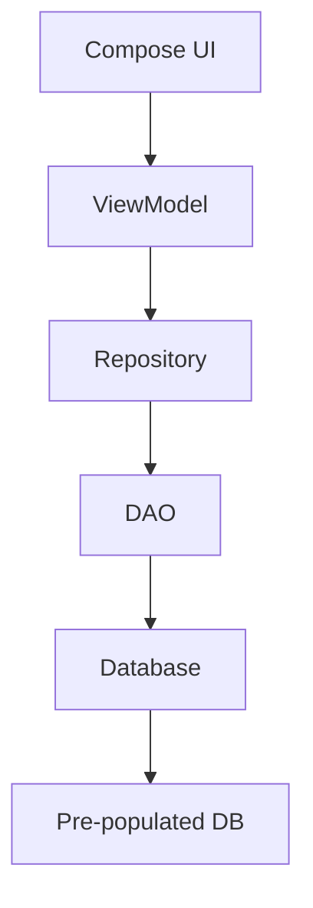

# Flight Search App Implementation Plan

## Overview
This document outlines the complete implementation of the Flight Search Android app following the Android Developer Codelab. The app allows users to search for airports and view available flight routes.

## Architecture
The app follows the MVVM architecture with Clean Architecture principles:



## Data Models

### Airport Entity
```kotlin
@Entity(tableName = "airport")
data class Airport(
    @PrimaryKey @ColumnInfo(name = "iata_code") val iataCode: String,
    @ColumnInfo(name = "name") val name: String,
    @ColumnInfo(name = "passengers") val passengers: Long
)
```

### FlightRoute Entity
```kotlin
@Entity(
    tableName = "flight_route",
    primaryKeys = ["departure_code", "destination_code"]
)
data class FlightRoute(
    @ColumnInfo(name = "departure_code") val departureCode: String,
    @ColumnInfo(name = "destination_code") val destinationCode: String
)
```

## File Structure

```
app/src/main/java/com/example/kcflightsearch/
├── MainActivity.kt
├── data/
│   ├── model/
│   │   ├── Airport.kt
│   │   └── FlightRoute.kt
│   ├── local/
│   │   ├── FlightSearchDatabase.kt
│   │   ├── AirportDao.kt
│   │   ├── FlightRouteDao.kt
│   │   └── Converters.kt
│   └── repository/
│       └── FlightSearchRepository.kt
├── ui/
│   ├── screens/
│   │   ├── SearchScreen.kt
│   │   └── FlightRouteScreen.kt
│   ├── components/
│   │   └── SearchBar.kt
│   ├── theme/
│   │   ├── Color.kt
│   │   ├── Theme.kt
│   │   └── Type.kt
│   └── FlightSearchApp.kt
└── viewmodel/
    └── FlightSearchViewModel.kt
```

## Implementation Steps

### Step 1: Dependencies
Add Room, Lifecycle, and Navigation dependencies to `libs.versions.toml` and `app/build.gradle.kts`

### Step 2: Data Layer
- Create Airport and FlightRoute entities
- Create DAOs with search queries
- Create Room Database class
- Create Repository

### Step 3: UI Layer
- Create Search Screen with text input and autocomplete
- Create Flight Route Display Screen
- Add Navigation
- Update MainActivity

### Step 4: Testing
- Add unit tests for Repository
- Verify compilation

## Database Schema
The app uses a pre-populated SQLite database with:
- `airport` table: airport codes, names, and passenger counts
- `flight_route` table: departure and destination airport codes

## Key Features
1. **Airport Search**: Search by airport name or IATA code
2. **Autocomplete**: Real-time search results as user types
3. **Flight Routes**: Display all available routes from a departure airport
4. **Route Details**: Show departure and destination airport information

## Dependencies Required
- Room Database
- Room Runtime
- Lifecycle ViewModel Compose
- Navigation Compose
- Coroutines
